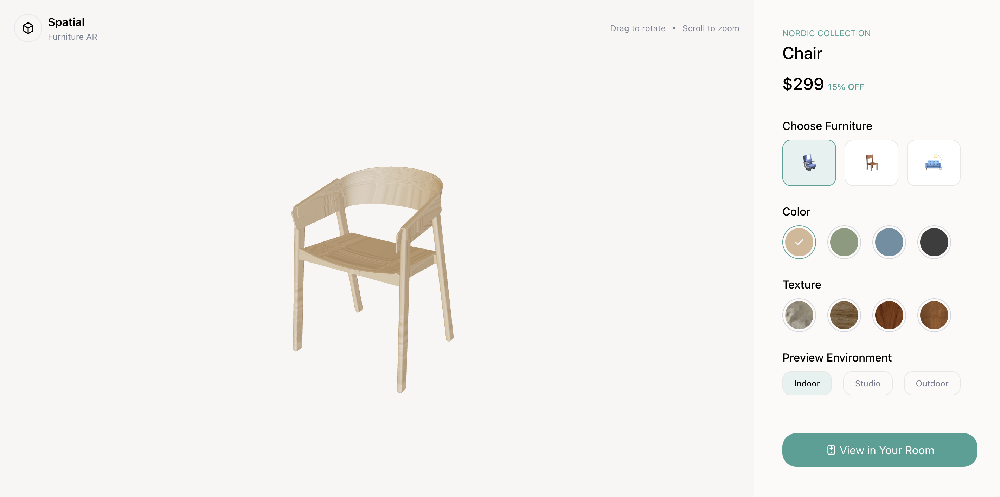
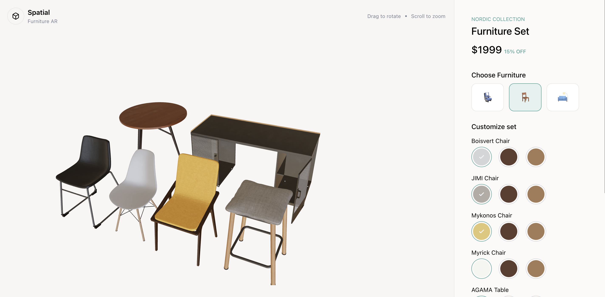

# Spatial — 3D Furniture Configurator
 
> Browser-based 3D product configurator with real-time material customization and AR-ready architecture.
 
 
 
**[Live Demo](https://spatial-ar-furniture-configurator.vercel.app/)**

⚠️ Early-stage prototype. AR functionality is planned but not yet implemented.
 
---

## What it does
 
- Load and interact with real GLTF/GLB furniture models — drag to rotate, scroll to zoom
- Switch between furniture pieces with per-item color and material memory
- Customize complex models part by part — desk surface, chair fabric, and frame finish independently
- Preview under different lighting environments: Indoor, Studio, Outdoor, Night
- Responsive — desktop side panel + mobile bottom sheet


## Built with
 
React · Three.js · react-three-fiber · @react-three/drei · Tailwind CSS


## Running locally

```bash
git clone https://github.com/AnuOuseph/Spatial-AR-Furniture-Configurator
cd Spatial-AR-Furniture-Configurator
npm install
npm start
```

## What's next
 
WebXR AR integration — place furniture in your actual room via phone camera.

---

[Portfolio](https://anuouseph.vercel.app) · [LinkedIn](https://linkedin.com/in/anuouseph) · [GitHub](https://github.com/AnuOuseph)
