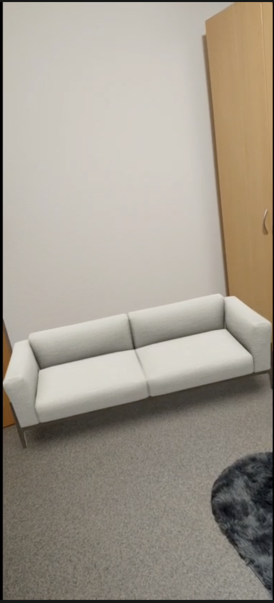
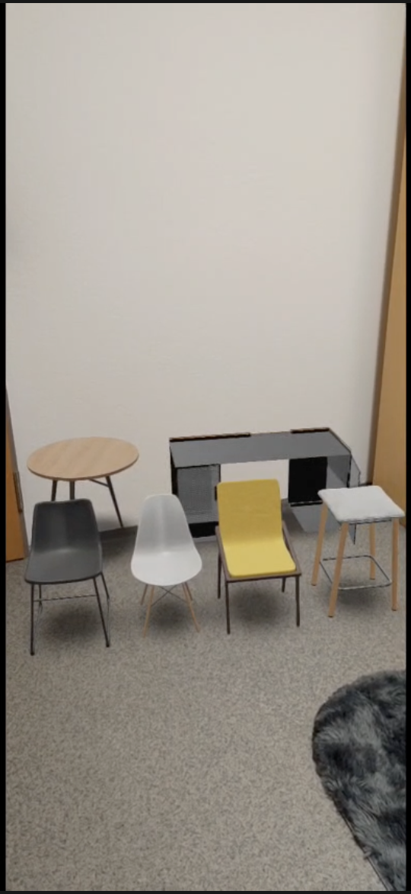
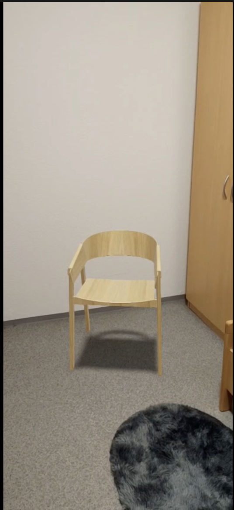

# Spatial — 3D Furniture Configurator

> Browser-based 3D product configurator with real-time material customization and WebXR AR - place furniture in your actual room via your phone camera.

 

**AR in action:**

  

**[Live Demo](https://spatial-ar-furniture-configurator.vercel.app/)** · *AR available on mobile (Android/iOS)*

---

## What it does

- Load and interact with real GLTF/GLB furniture models — drag to rotate, scroll to zoom
- Switch between furniture pieces with per-item color and material memory
- Customize complex models part by part — desk surface, chair fabric, and frame finish independently
- Preview under different lighting environments: Indoor, Studio, Outdoor, Night
- Place furniture in your actual room via WebXR AR — tap the floor to position, drag to move
- Responsive — desktop side panel + mobile bottom sheet
- AR available on Android (Chrome) and iOS (Safari/Quick Look)
- AR preview shown in default model finish — real-time material customization in AR is planned

---

## Built with

React · Three.js · react-three-fiber · @react-three/drei · model-viewer · Tailwind CSS

---

## Running locally

```bash
git clone https://github.com/AnuOuseph/Spatial-AR-Furniture-Configurator
cd Spatial-AR-Furniture-Configurator
npm install
npm start
```

---

## Contributing

Licensed under the [MIT License](./LICENSE).

---

[Portfolio](https://anuouseph.vercel.app) · [LinkedIn](https://linkedin.com/in/anuouseph) · [GitHub](https://github.com/AnuOuseph)